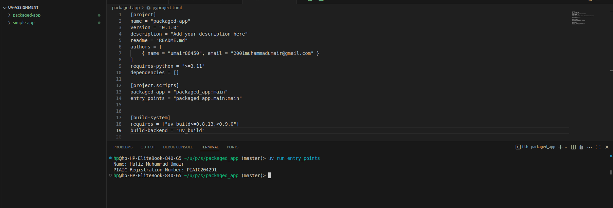

# UV Project Assignment - Simple & Packaged Applications

## 📄 Description
This project demonstrates the creation and execution of **UV simple and packaged Python applications**.  
Each application prints **my Name and PIAIC Registration Number** using a function in `main.py`.

---

## 🛠️ Step-by-Step Procedure

### 1. Folder Creation
- Created a parent folder for the assignment: `uv-assignment`.
- Inside the folder, created two subfolders:
  - `simple-app`
  - `packaged-app`

---

### 2. Simple Application Setup

1. Initialized the simple app using UV:
   ```bash
   uv init simple-app
   ```

2. Entered the folder:
   ```bash
   cd simple-app
   ```

3. Synced the environment with dependencies:
   ```bash
   uv sync
   ```

4. Created `main.py` and added the following function:
   ```python
   def main():
       print("Name: Hafiz Muhammad Umair")
       print("PIAIC Registration Number: PIAIC204291")
   ```

5. Ran the simple app using:
   ```bash
   uv run main.py
   ```
   This successfully printed Name and PIAIC Registration Number.

---

### 3. Packaged Application Setup

1. Initialized the packaged app using UV:
   ```bash
   uv init --package packaged-app
   ```

2. Entered the packaged-app folder:
   ```bash
   cd packaged-app
   ```

3. Synced the environment:
   ```bash
   uv sync
   ```

4. Entered `src` folder and created package folder:
   ```bash
   cd src/packaged_app
   ```

5. Created `main.py` and added the function:
   ```python
   def main():
       print("Name: Hafiz Muhammad Umair")
       print("PIAIC Registration Number: PIAIC204291")
   ```

6. Opened `pyproject.toml` and created an entry point:
   ```toml
   [project.scripts]
   entry = "packaged_app.main:main"
   ```

7. Ran the packaged app using the entry point:
   ```bash
   uv run entry
   ```
   This successfully printed Name and PIAIC Registration Number.

---

## ⚡ Use Case

- **Simple UV App**: Quick script execution with minimal setup, useful for small tasks or testing functions.
- **Packaged UV App**: Organizes code in `src` layout, allows modular development, CLI script execution, and is scalable for bigger projects.

---

## 🖼️ Screenshot of Output

Below is a combined terminal output showing both the **Simple App** and **Packaged App** running successfully and displaying the required information:


---

## ✅ Git Setup and Commands

Configure Git username and email (run once per machine):
```bash
git config --global user.name "username"
git config --global user.email "yourmail@gmail.com"
```

### Common Git Commands:
```bash
# Initialize repository
git init

# Add all files
git add .

# Commit changes
git commit -m "Initial commit"

# Add remote repository
git remote add origin https://github.com/Umair86450/uv-assignment.git

# Push to GitHub
git push -u origin main
```

